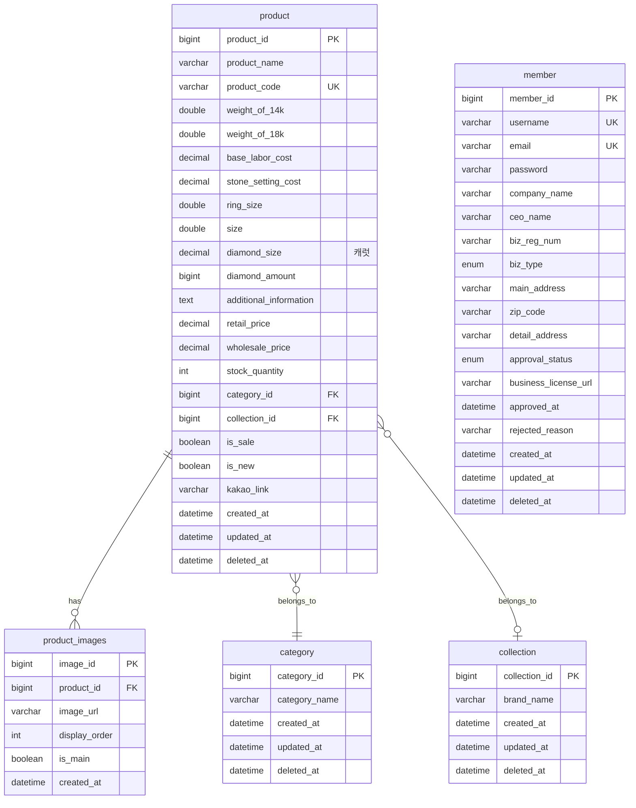

# PRD Refinement Plan: Marvelring B2B Platform

**Plan Version:** 1.1
**Created:** 2026-01-26
**Status:** Ready for Critic Review (Revision 2)

---

## 1. Executive Summary

### 1.1 목적
기존 PRD를 새로운 요구사항에 맞게 전면 개선:
1. **디자인 시스템 변경**: Ivory/Cream 기반 → 흑백 고대비(High-Contrast) 미니멀 럭셔리
2. **ERD 수정**: 누락된 필드, FK 관계, 새 테이블 추가
3. **상품 스펙 간소화**: 복잡한 다이아몬드 4C 등급 제거 → 간소화된 스펙

### 1.2 핵심 변경 요약

| 영역 | 기존 PRD | 새 요구사항 | 영향도 |
|------|----------|-------------|--------|
| Color Palette | Ivory #ebdebf 기반 | Pure White #FFFFFF + Black #000000 | HIGH |
| Typography | 18px 기본 | 18px 유지, Line Height 1.6-1.8 명시 | LOW |
| Card Design | 언급 없음 | Border-radius: 0px (직각), 1px 테두리 | MEDIUM |
| Button | 언급 없음 | 56px 높이, Black 배경, White 텍스트 | MEDIUM |
| ERD | 기존 스키마 | FK 추가, product_images 테이블, member 필드 추가 | HIGH |
| Product Specs | 다이아몬드 4C, 인증, 안전 | weight, labor cost, 다이아 개수/사이즈만 | HIGH |

### 1.3 수정 대상 파일

- **PRD 파일**: `/Users/parkdongkyu/my_project/marvelring/.shipspec/planning/marvelring-b2b-platform/PRD.md`

---

## 2. Gap Analysis (기존 PRD vs 새 요구사항)

### 2.1 디자인 시스템 차이점

#### 2.1.1 Color Palette

**기존 PRD (REQ-011):**
```
- Base: #ebdebf (Ivory/Cream)
- Accent: #c19a2e (Champagne Gold)
- Gray hierarchy
```

**새 요구사항:**
```
- Primary Background: #FFFFFF (Pure White)
- Secondary Background: #FAFAF8 (Off-White)
- Primary Text/UI: #000000 (Solid Black)
- Secondary Text: #333333 ~ #666666 (Dark Gray)
- Accent (Gold): #C19A2E (Champagne Gold) - 유지
- Border/Divider: #E8E4DA 또는 #DDDDDD - 1px 실선
```

**필요한 변경:**
- [ ] REQ-011 전면 재작성
- [ ] Tailwind CSS theme 설정 예시 업데이트
- [ ] 고대비(High-Contrast) 디자인 원칙 명시

#### 2.1.2 Typography

**기존 PRD (REQ-012):**
```
- Base font: 18px
- Font family: Inter or similar
- Line height: 1.6
```

**새 요구사항:**
```
- H1: 32px-36px Bold
- H2: 24px-28px Bold
- Body: 18px (유지)
- Captions: 14px-16px
- Line Height: 1.6-1.8
```

**필요한 변경:**
- [ ] REQ-012 확장 - 상세 타이포그래피 계층 추가

#### 2.1.3 Layout & Components

**기존 PRD:**
- Product Grid: 3-4열 (desktop)
- Touch targets: 48px minimum

**새 요구사항:**
```
- 섹션 간 48px-64px 여백
- Product Grid: 4열 고정, 카드 간격 24px
- Card: #FFFFFF 배경, 1px 테두리, border-radius: 0px (직각)
- Primary Button: 56px 높이, Black 배경, White 텍스트
- Touch Targets: 최소 48px (유지)
```

**필요한 변경:**
- [ ] 새 요구사항 REQ-011A "Layout & Spacing Standards" 추가
- [ ] 새 요구사항 REQ-011B "Component Design Standards" 추가

### 2.2 ERD 차이점

#### 2.2.1 기존 PRD 스키마 (REQ-021)

```typescript
Product {
  // Basic Info
  name, product_number, description

  // Material Specs
  gold_type, gold_weight, total_weight

  // Diamond Specs (복잡함)
  diamond_size, diamond_shape, diamond_color, diamond_clarity,
  diamond_cut, diamond_certification, diamond_certificate_number

  // Craftsmanship (복잡함)
  stone_setting, finish_type, clasp_type, chain_style, chain_length

  // Size & Business
  standard_size, wholesale_price, retail_price, labor_cost,
  stock_quantity, moq, lead_time_days, origin_country

  // Safety (복잡함)
  is_lead_free, is_nickel_free, is_hypoallergenic,
  kc_certified, kc_certificate_number

  // Media
  main_image_url, images (jsonb), is_sale, kakao_link
}
```

#### 2.2.2 새 ERD 요구사항

```sql
-- product 테이블 (간소화됨)
product (
  product_id BIGINT PRIMARY KEY,
  product_name VARCHAR(255),
  product_code VARCHAR(255),
  weight_of_14k DOUBLE,        -- 14K 중량
  weight_of_18k DOUBLE,        -- 18K 중량
  base_labor_cost DECIMAL,     -- 기본 공임
  stone_setting_cost DECIMAL,  -- 알 공임
  ring_size DOUBLE,            -- 반지 호수
  size DOUBLE,                 -- 일반 사이즈 (cm)
  diamond_size BIGINT,         -- 다이아 사이즈
  diamond_amount BIGINT,       -- 다이아 개수
  additional_information TEXT, -- 추가사항
  retail_price DECIMAL,
  wholesale_price DECIMAL,
  stock_quantity INT,
  created_at, updated_at, deleted_at

  -- 누락됨 (추가 필요):
  category_id FK,
  collection_id FK
)

-- member 테이블 (누락된 필드)
member (
  -- 기존 필드...

  -- 누락됨 (추가 필요):
  approval_status ENUM('pending', 'approved', 'rejected'),
  business_license_url VARCHAR(255)
)

-- 새 테이블 필요:
product_images (
  image_id BIGINT PRIMARY KEY,
  product_id FK,
  image_url VARCHAR(255),
  display_order INT,
  is_main BOOLEAN
)
```

#### 2.2.3 ERD 수정 목록

| 문제점 | 해결 방안 | 우선순위 |
|--------|-----------|----------|
| product에 category_id FK 누락 | FK 컬럼 추가 | HIGH |
| product에 collection_id FK 누락 | FK 컬럼 추가 | HIGH |
| member에 approval_status 누락 | ENUM 필드 추가 | HIGH |
| member에 business_license_url 누락 | VARCHAR 필드 추가 | HIGH |
| product_images 테이블 없음 | 새 테이블 생성 | HIGH |
| FK 제약조건 정의 없음 | FK 제약조건 명시 | MEDIUM |

### 2.3 상품 상세 페이지 스펙 차이점

#### 2.3.1 기존 PRD (REQ-007) - 복잡한 스펙

```
- Product Identity: name, product_number, creation_date
- Material Specs: gold_type, gold_weight, total_weight
- Diamond Specs: size, shape, color, clarity, cut, certification, certificate_number
- Craftsmanship: stone_setting, finish_type, clasp_type, chain_style, chain_length
- Size & Availability: standard_size, stock_quantity, MOQ, lead_time
- Safety & Certification: lead_free, nickel_free, hypoallergenic, KC certification
- Pricing: 가격 표시 로직 (유지)
```

#### 2.3.2 새 요구사항 - 간소화된 스펙

```
1. 제품명
2. 제품코드 (텍스트 + 숫자)
3. 중량 (14K/18K): ex) 10g / 15.2g
4. 기본 공임 가격
5. 알 공임 가격
6. 기성 사이즈 (반지는 호, 나머지는 cm)
7. 다이아 개수와 사이즈
8. 추가사항 (텍스트)
```

#### 2.3.3 제거되는 필드

| 필드 | 이유 |
|------|------|
| diamond_shape | 간소화 |
| diamond_color | 4C 등급 제거 |
| diamond_clarity | 4C 등급 제거 |
| diamond_cut | 4C 등급 제거 |
| diamond_certification | 인증 정보 제거 |
| diamond_certificate_number | 인증 정보 제거 |
| stone_setting | Craftsmanship 제거 |
| finish_type | Craftsmanship 제거 |
| clasp_type | Craftsmanship 제거 |
| chain_style | Craftsmanship 제거 |
| chain_length | Craftsmanship 제거 |
| is_lead_free | 안전 인증 제거 |
| is_nickel_free | 안전 인증 제거 |
| is_hypoallergenic | 안전 인증 제거 |
| kc_certified | KC 인증 제거 |
| kc_certificate_number | KC 인증 제거 |
| moq | 비즈니스 필드 간소화 |
| lead_time_days | 비즈니스 필드 간소화 |
| origin_country | 비즈니스 필드 간소화 |

---

## 3. Detailed Change Plan

### 3.1 Section 1: Overview (영향도: LOW)

**변경 사항:**
- [ ] 1.2 Proposed Solution: 디자인 언어 변경 ("ivory/marble design language" → "high-contrast black & white design language")

**예상 작업량:** 1 문단 수정

### 3.2 Section 2.1: Core Features (영향도: MEDIUM)

**변경 사항:**
- [ ] REQ-007 Product Detail Page: 전면 재작성
  - 새 스펙 구조로 변경
  - 다이아몬드 4C, 인증, 안전 섹션 제거
  - 간소화된 8개 필드 구조로 대체

#### REQ-007 Product Detail Page (재작성 텍스트)
```markdown
**REQ-007: Product Detail Page (Simplified)**
- Description: The system shall display product specifications organized in sections:
  - **Product Identity**: 제품명 (product_name), 제품코드 (product_code)
  - **Material Specifications**: 14K 중량 (weight_of_14k), 18K 중량 (weight_of_18k) - 형식: "14K: 10g / 18K: 15.2g"
  - **Cost Information**: 기본 공임 (base_labor_cost), 알 공임 (stone_setting_cost)
  - **Size Information**: 기성 사이즈 - 반지는 호 (ring_size), 나머지는 cm (size)
  - **Diamond Information**: 다이아 개수 (diamond_amount), 다이아 사이즈 (diamond_size, 캐럿)
  - **Additional**: 추가사항 (additional_information)
  - **Pricing**: (기존 REQ-008 가격 표시 로직 유지)
  - **Image Gallery**: 1-10 images with zoom functionality
- Priority: High
- Rationale: Simplified specification structure focuses on essential B2B product information; removes unnecessary complexity (4C grading, certifications) per user requirements.
```

**예상 작업량:** REQ-007 전면 재작성 (약 50줄)

### 3.3 Section 2.2: User Interface (영향도: HIGH)

**변경 사항:**

#### REQ-011 Design System Colors (전면 재작성)
```markdown
**REQ-011: High-Contrast Design System**
- Description: The system shall implement a high-contrast black & white color palette optimized for 40-60 age demographic:
  - Primary Background: #FFFFFF (Pure White)
  - Secondary Background: #FAFAF8 (Off-White)
  - Primary Text/UI Elements: #000000 (Solid Black)
  - Secondary Text: #333333 ~ #666666 (Dark Gray)
  - Accent (Gold): #C19A2E (Champagne Gold) - for NEW badges, icons
  - Border/Divider: #E8E4DA or #DDDDDD - 1px solid lines
- Priority: High
- Rationale: High-contrast palette improves readability for older users while maintaining minimal luxury aesthetic suitable for professional B2B jewelry platform.
```

#### REQ-011A Layout & Spacing Standards (신규)
```markdown
**REQ-011A: Layout & Spacing Standards**
- Description: The system shall implement consistent spacing:
  - Section spacing: 48px-64px vertical margin between major sections
  - Product Grid: 4-column layout on desktop, 24px gap between cards
  - Container max-width: Appropriate for jewelry product display
- Priority: High
- Rationale: Generous whitespace creates premium feel and improves scannability for target demographic.
```

#### REQ-011B Component Design Standards (신규)
```markdown
**REQ-011B: Component Design Standards**
- Description: The system shall implement consistent component styling:
  - Cards: #FFFFFF background, 1px border (#E8E4DA), border-radius: 0px (sharp corners)
  - Primary Buttons: 56px height, #000000 background, #FFFFFF text, sharp corners
  - Secondary Buttons: 56px height, #FFFFFF background, #000000 text, 1px #000000 border
  - Touch Targets: Minimum 48px for all interactive elements
- Priority: High
- Rationale: Sharp geometric styling reinforces minimal luxury aesthetic; large buttons improve usability for 40-60 age group.
```

#### REQ-012 Typography Standards (확장)
```markdown
**REQ-012: Typography Standards**
- Description: The system shall use Inter font family with the following hierarchy:
  - H1: 32px-36px, Bold weight
  - H2: 24px-28px, Bold weight
  - Body: 18px, Regular weight (optimized for 40-60 age group)
  - Captions/Labels: 14px-16px
  - Line Height: 1.6-1.8 for optimal readability
- Priority: High
- Rationale: Large, clear typography with generous line spacing reduces eye strain for older users.
```

**예상 작업량:** 4개 요구사항 재작성/추가 (약 60줄)

### 3.4 Section 2.3: Data & Storage (영향도: HIGH)

**변경 사항:**

#### REQ-020 User Profile Schema (수정)
- [ ] approval_status, business_license_url 필드 명시적 추가 확인
- [ ] 새 ERD member 테이블과 일치하도록 조정

#### REQ-021 Product Schema (전면 재작성)
```markdown
**REQ-021: Product Schema**
- Description: The system shall store products with the following fields:
  - **Basic Info**:
    - product_name (VARCHAR 255, required)
    - product_code (VARCHAR 255, unique, required)
  - **Material Specs**:
    - weight_of_14k (DOUBLE, grams)
    - weight_of_18k (DOUBLE, grams)
  - **Cost Info**:
    - base_labor_cost (DECIMAL 8,2) - 기본 공임
    - stone_setting_cost (DECIMAL 8,2) - 알 공임
  - **Size Info**:
    - ring_size (DOUBLE) - 반지 호수 (e.g., 13호)
    - size (DOUBLE) - 일반 사이즈 (cm)
  - **Diamond Info**:
    - diamond_size (DECIMAL 5,2) - 다이아 사이즈 (캐럿, 예: 0.25, 1.50)
    - diamond_amount (BIGINT) - 다이아 개수
  - **Additional**:
    - additional_information (TEXT) - 추가사항
  - **Pricing**:
    - retail_price (DECIMAL 8,2)
    - wholesale_price (DECIMAL 8,2)
  - **Inventory**:
    - stock_quantity (INT)
  - **Relationships**:
    - category_id (FK → category.category_id)
    - collection_id (FK → collection.collection_id)
  - **Timestamps**:
    - created_at (DATETIME, required)
    - updated_at (DATETIME, nullable)
    - deleted_at (DATETIME, nullable) - soft delete
- Priority: High
- Rationale: Simplified schema matches actual business requirements; removed unnecessary complexity (4C grading, certifications, craftsmanship details).
```

#### REQ-021A Product Images Schema (신규)
```markdown
**REQ-021A: Product Images Schema**
- Description: The system shall store product images in a separate table:
  - image_id (BIGINT, PRIMARY KEY, AUTO_INCREMENT)
  - product_id (FK → product.product_id, required)
  - image_url (VARCHAR 255, required)
  - display_order (INT, default 0)
  - is_main (BOOLEAN, default false)
  - created_at (DATETIME, required)

  Constraints:
  - Each product must have exactly one image with is_main = true
  - display_order determines gallery order
  - Maximum 10 images per product
- Priority: High
- Rationale: Separate image table enables proper normalization and flexible image management.
```

#### REQ-022 Category Schema (유지, FK 관계 명확화)
- [ ] product와의 FK 관계 명시

#### REQ-022A Collection Schema (신규 또는 명확화)
```markdown
**REQ-022A: Collection Schema**
- Description: The system shall store collections (brand categories):
  - collection_id (BIGINT, PRIMARY KEY, AUTO_INCREMENT)
  - brand_name (VARCHAR 255, required)
  - created_at (DATETIME, required)
  - updated_at (DATETIME, nullable)
  - deleted_at (DATETIME, nullable)
- Priority: High
- Rationale: Separate collection table for brand categorization (Cartier, Chanel, etc.)
```

**예상 작업량:** 3개 요구사항 재작성/추가 (약 80줄)

### 3.5 Section 2.7: Admin Product Management (영향도: HIGH)

**변경 사항:**

#### REQ-060 Admin Product Creation (전면 재작성)
```markdown
**REQ-060: Admin Product Creation with Simplified Specifications**
- Description: The system shall allow administrators to create new products with:
  - **Required Fields**:
    - product_name
    - product_code (unique)
    - weight_of_14k OR weight_of_18k (at least one)
    - base_labor_cost
    - retail_price
    - wholesale_price
    - At least one product image (main)
  - **Optional Fields**:
    - stone_setting_cost (알 공임)
    - ring_size (반지인 경우)
    - size (일반 사이즈, cm)
    - diamond_size
    - diamond_amount
    - additional_information
    - stock_quantity
  - **Category Assignment**:
    - category_id (required)
    - collection_id (optional)
- Priority: High
- Rationale: Simplified form reduces admin data entry burden; focuses on essential product information only.
```

#### REQ-065 Admin Product Validation Rules (수정)
- [ ] 새 간소화된 필드에 맞게 검증 규칙 업데이트

**예상 작업량:** 2개 요구사항 재작성 (약 40줄)

### 3.6 Section 3: User Stories (영향도: MEDIUM)

**변경 사항:**
- [ ] 3.3 Product Inquiry: 간소화된 스펙 반영
- [ ] 3.7 Admin Product Management: 간소화된 필드 반영

**예상 작업량:** 2개 User Story 수정 (약 20줄)

### 3.7 Section 4: Technical Considerations (영향도: LOW)

**변경 사항:**
- [ ] 4.3 Technical Decisions: 간소화 결정 추가

**예상 작업량:** 1개 항목 추가 (약 5줄)

### 3.8 Section 7: Appendix (영향도: MEDIUM)

**변경 사항:**
- [ ] 7.2 Glossary: 제거된 용어 삭제 (4C, 인증 등)
- [ ] 7.3 Research Sources: 간소화로 불필요해진 참조 제거
- [ ] 7.4 Revision History: 1.4 버전 추가

**예상 작업량:** Glossary 정리 (약 30줄 삭제), 버전 기록 추가 (5줄)

---

## 4. Complete ERD Definition (수정된 버전)

### 4.1 Tables

```sql
-- ==========================================
-- PRODUCT TABLE (간소화됨)
-- ==========================================
CREATE TABLE `product` (
    `product_id` BIGINT UNSIGNED NOT NULL AUTO_INCREMENT PRIMARY KEY,
    `product_name` VARCHAR(255) NOT NULL,
    `product_code` VARCHAR(255) NOT NULL UNIQUE,

    -- Material Specs
    `weight_of_14k` DOUBLE NULL COMMENT '14K 중량 (g)',
    `weight_of_18k` DOUBLE NULL COMMENT '18K 중량 (g)',

    -- Cost Info
    `base_labor_cost` DECIMAL(10, 2) NOT NULL COMMENT '기본 공임',
    `stone_setting_cost` DECIMAL(10, 2) NULL COMMENT '알 공임',

    -- Size Info
    `ring_size` DOUBLE NULL COMMENT '반지 호수 (e.g., 13)',
    `size` DOUBLE NULL COMMENT '일반 사이즈 (cm)',

    -- Diamond Info
    `diamond_size` DECIMAL(5, 2) NULL COMMENT '다이아 사이즈 (캐럿, 예: 0.25, 1.50)',
    `diamond_amount` BIGINT NULL COMMENT '다이아 개수',

    -- Additional
    `additional_information` TEXT NULL COMMENT '추가사항',

    -- Pricing
    `retail_price` DECIMAL(10, 2) NOT NULL,
    `wholesale_price` DECIMAL(10, 2) NOT NULL,

    -- Inventory
    `stock_quantity` INT NOT NULL DEFAULT 0,

    -- Foreign Keys
    `category_id` BIGINT UNSIGNED NOT NULL,
    `collection_id` BIGINT UNSIGNED NULL,

    -- Flags
    `is_sale` BOOLEAN NOT NULL DEFAULT FALSE,
    `is_new` BOOLEAN NOT NULL DEFAULT FALSE,

    -- KakaoTalk
    `kakao_link` VARCHAR(500) NULL,

    -- Timestamps
    `created_at` DATETIME NOT NULL DEFAULT CURRENT_TIMESTAMP,
    `updated_at` DATETIME NULL ON UPDATE CURRENT_TIMESTAMP,
    `deleted_at` DATETIME NULL,

    -- Indexes
    INDEX `idx_product_code` (`product_code`),
    INDEX `idx_category` (`category_id`),
    INDEX `idx_collection` (`collection_id`),
    INDEX `idx_created_at` (`created_at`),

    -- Foreign Key Constraints
    CONSTRAINT `fk_product_category`
        FOREIGN KEY (`category_id`) REFERENCES `category`(`category_id`),
    CONSTRAINT `fk_product_collection`
        FOREIGN KEY (`collection_id`) REFERENCES `collection`(`collection_id`)
);

-- ==========================================
-- PRODUCT_IMAGES TABLE (신규)
-- ==========================================
CREATE TABLE `product_images` (
    `image_id` BIGINT UNSIGNED NOT NULL AUTO_INCREMENT PRIMARY KEY,
    `product_id` BIGINT UNSIGNED NOT NULL,
    `image_url` VARCHAR(500) NOT NULL,
    `display_order` INT NOT NULL DEFAULT 0,
    `is_main` BOOLEAN NOT NULL DEFAULT FALSE,
    `created_at` DATETIME NOT NULL DEFAULT CURRENT_TIMESTAMP,

    INDEX `idx_product_images` (`product_id`, `display_order`),

    CONSTRAINT `fk_images_product`
        FOREIGN KEY (`product_id`) REFERENCES `product`(`product_id`)
        ON DELETE CASCADE
);

-- ==========================================
-- MEMBER TABLE (수정됨)
-- ==========================================
CREATE TABLE `member` (
    `member_id` BIGINT UNSIGNED NOT NULL AUTO_INCREMENT PRIMARY KEY,
    `username` VARCHAR(255) NOT NULL UNIQUE,
    `email` VARCHAR(255) NOT NULL UNIQUE,
    `password` VARCHAR(255) NOT NULL,

    -- Business Info
    `company_name` VARCHAR(255) NOT NULL COMMENT '상호명',
    `ceo_name` VARCHAR(255) NOT NULL COMMENT '대표자명',
    `biz_reg_num` VARCHAR(20) NOT NULL COMMENT '사업자 등록 번호',
    `biz_type` ENUM('RETAIL', 'WHOLESALE') NOT NULL COMMENT '도매/소매',

    -- Address
    `main_address` VARCHAR(255) NOT NULL COMMENT '주소',
    `zip_code` VARCHAR(10) NOT NULL COMMENT '우편번호',
    `detail_address` VARCHAR(255) NULL COMMENT '상세 주소',

    -- Approval (추가됨)
    `approval_status` ENUM('pending', 'approved', 'rejected') NOT NULL DEFAULT 'pending',
    `business_license_url` VARCHAR(500) NULL COMMENT '사업자등록증 URL',
    `approved_at` DATETIME NULL,
    `rejected_reason` VARCHAR(500) NULL,

    -- Timestamps
    `created_at` DATETIME NOT NULL DEFAULT CURRENT_TIMESTAMP,
    `updated_at` DATETIME NULL ON UPDATE CURRENT_TIMESTAMP,
    `deleted_at` DATETIME NULL,

    INDEX `idx_approval_status` (`approval_status`),
    INDEX `idx_biz_type` (`biz_type`)
);

-- ==========================================
-- COLLECTION TABLE (유지)
-- ==========================================
CREATE TABLE `collection` (
    `collection_id` BIGINT UNSIGNED NOT NULL AUTO_INCREMENT PRIMARY KEY,
    `brand_name` VARCHAR(255) NOT NULL,
    `created_at` DATETIME NOT NULL DEFAULT CURRENT_TIMESTAMP,
    `updated_at` DATETIME NULL ON UPDATE CURRENT_TIMESTAMP,
    `deleted_at` DATETIME NULL
);

-- ==========================================
-- CATEGORY TABLE (유지)
-- ==========================================
CREATE TABLE `category` (
    `category_id` BIGINT UNSIGNED NOT NULL AUTO_INCREMENT PRIMARY KEY,
    `category_name` VARCHAR(255) NOT NULL,
    `created_at` DATETIME NOT NULL DEFAULT CURRENT_TIMESTAMP,
    `updated_at` DATETIME NULL ON UPDATE CURRENT_TIMESTAMP,
    `deleted_at` DATETIME NULL
);
```

### 4.2 ERD Diagram (Mermaid)



---

## 5. Task List (구체적인 수정 작업)

### 5.1 Phase 1: Design System Updates

| Task ID | Task | Section | 영향도 | 예상 시간 |
|---------|------|---------|--------|-----------|
| DS-001 | REQ-011 전면 재작성 (Ivory → High-Contrast B&W) | 2.2 | HIGH | 15분 |
| DS-002 | REQ-011A Layout & Spacing Standards 신규 작성 | 2.2 | MEDIUM | 10분 |
| DS-003 | REQ-011B Component Design Standards 신규 작성 | 2.2 | MEDIUM | 10분 |
| DS-004 | REQ-012 Typography 확장 (H1/H2/Body/Caption 계층) | 2.2 | LOW | 5분 |
| DS-005 | Overview 1.2 디자인 언어 업데이트 | 1 | LOW | 2분 |

### 5.2 Phase 2: ERD & Schema Updates

| Task ID | Task | Section | 영향도 | 예상 시간 |
|---------|------|---------|--------|-----------|
| ERD-001 | REQ-021 Product Schema 전면 재작성 (간소화) | 2.3 | HIGH | 20분 |
| ERD-002 | REQ-021A Product Images Schema 신규 작성 | 2.3 | HIGH | 10분 |
| ERD-003 | REQ-020 User Profile Schema 수정 (approval, license URL) | 2.3 | MEDIUM | 5분 |
| ERD-004 | REQ-022A Collection Schema 명확화 | 2.3 | LOW | 5분 |
| ERD-005 | FK 관계 명시 (product → category, collection) | 2.3 | MEDIUM | 5분 |

### 5.3 Phase 3: Product Detail & Admin Updates

| Task ID | Task | Section | 영향도 | 예상 시간 |
|---------|------|---------|--------|-----------|
| PD-001 | REQ-007 Product Detail Page 전면 재작성 (간소화된 8필드) | 2.1 | HIGH | 20분 |
| PD-002 | REQ-060 Admin Product Creation 전면 재작성 | 2.7 | HIGH | 15분 |
| PD-003 | REQ-065 Admin Validation Rules 수정 | 2.7 | MEDIUM | 10분 |
| PD-004 | REQ-061 Image Upload 수정 (product_images 테이블 반영) | 2.7 | MEDIUM | 10분 |

### 5.4 Phase 4: User Stories & Cleanup

| Task ID | Task | Section | 영향도 | 예상 시간 |
|---------|------|---------|--------|-----------|
| US-001 | User Story 3.3 수정 (간소화된 스펙) | 3 | MEDIUM | 10분 |
| US-002 | User Story 3.7 수정 (간소화된 Admin 작업) | 3 | MEDIUM | 10분 |
| CL-001 | Glossary 정리 (4C, 인증, Craftsmanship 용어 제거) | 7.2 | LOW | 10분 |
| CL-002 | Research Sources 정리 (불필요한 참조 제거) | 7.3 | LOW | 5분 |
| CL-003 | Revision History 1.4 추가 | 7.4 | LOW | 2분 |
| CL-004 | Technical Decisions 간소화 결정 추가 | 4.3 | LOW | 5분 |

### 5.5 예상 시간 합계

| Phase | 작업 수 | 예상 시간 |
|-------|---------|-----------|
| Phase 1: Design System Updates | 5 | 42분 |
| Phase 2: ERD & Schema Updates | 5 | 45분 |
| Phase 3: Product Detail & Admin Updates | 4 | 55분 |
| Phase 4: User Stories & Cleanup | 6 | 42분 |
| **총계** | **20** | **184분 (약 3시간)** |

---

## 6. Deliverables Checklist

### 6.1 PRD 수정 완료 체크리스트

- [ ] Section 1 (Overview): 디자인 언어 업데이트
- [ ] Section 2.1 (Core Features): REQ-007 전면 재작성
- [ ] Section 2.2 (User Interface): REQ-011, 011A, 011B, 012 재작성/추가
- [ ] Section 2.3 (Data & Storage): REQ-020, 021, 021A, 022A 재작성/추가
- [ ] Section 2.7 (Admin Management): REQ-060, 061, 065 재작성
- [ ] Section 3 (User Stories): 3.3, 3.7 수정
- [ ] Section 4 (Technical Considerations): 간소화 결정 추가
- [ ] Section 7.2 (Glossary): 제거된 용어 정리
- [ ] Section 7.3 (Research Sources): 불필요한 참조 제거
- [ ] Section 7.4 (Revision History): 1.4 버전 추가

### 6.2 ERD 업데이트 체크리스트

- [ ] product 테이블 간소화 (복잡한 필드 제거)
- [ ] product 테이블 FK 추가 (category_id, collection_id)
- [ ] product_images 테이블 신규 생성
- [ ] member 테이블 필드 추가 (approval_status, business_license_url)
- [ ] FK 제약조건 명시

---

## 7. Success Criteria

PRD 개선 완료 시 다음 조건 충족:

1. **디자인 시스템**: 흑백 고대비 팔레트가 모든 UI 요구사항에 반영됨
2. **ERD 정합성**: 새 ERD와 PRD 스키마 요구사항이 100% 일치함
3. **상품 스펙 간소화**: Product Detail 페이지가 8개 필드만 표시
4. **제거된 복잡성**: 4C 등급, 인증, Craftsmanship 관련 모든 참조 제거
5. **일관성**: 모든 섹션이 새 요구사항과 일치하게 업데이트됨

---

## 8. Notes for Executor

### 8.1 주의사항

1. **가격 표시 로직 유지**: REQ-008, 008A, 008B, 008C는 변경하지 않음 (기존 비즈니스 규칙 유지)
2. **KakaoTalk 연동 유지**: kakao_link 필드 및 관련 요구사항 유지
3. **승인 워크플로우 유지**: 사용자 승인 관련 요구사항 유지 (REQ-003, 004 등)
4. **NEW/SALE 기능 유지**: 관련 요구사항 유지

### 8.2 우선순위

1. **HIGH**: ERD 수정 (데이터 모델이 다른 모든 것의 기반)
2. **HIGH**: 디자인 시스템 (시각적 일관성 핵심)
3. **MEDIUM**: 상품 상세 스펙 간소화
4. **LOW**: Glossary, Research Sources 정리

---

### 8.3 Revision History 1.4 내용

PRD 파일의 Revision History 섹션에 추가할 내용:

```markdown
| 1.4 | 2026-01-26 | Product Team | 사용자 요구사항 반영: 디자인 시스템 변경 (Ivory → High-Contrast B&W), ERD 간소화 (다이아몬드 4C 등급, 인증, 안전 필드 제거), 상품 상세 페이지 간소화 (8개 필드), diamond_size 데이터 타입 DECIMAL(5,2)로 변경 |
```

---

**Plan Status:** READY FOR CRITIC REVIEW (Revision 2)
